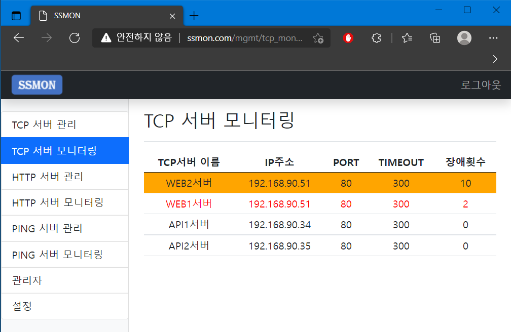

# SSMON (Simple Server Monitor) - 시스템 모니터링

* `아직 개발중입니다...`
* ERD : https://dbdiagram.io/d/615640cb825b5b01461b8253
* 개발언어 : [Go](https://golang.org/)
* 운영환경 : Ubuntu Linux + MySQL + [Fiber](https://gofiber.io/) + [GORM](https://gorm.io/)
* 기능
  * PING 체크
  * TCP 포트 체크
  * HTTP 체크
  * CPU, RAM, HDD 체크 (Agent 설치)
  * Slack 알림

### 스크린샷

